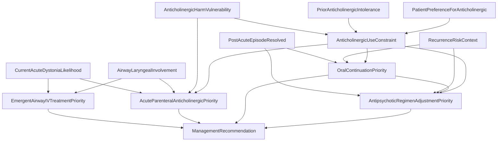

# Bayesian Network Topic Package: Anticholinergic Medication for Acute Dystonia Associated With Antipsychotic Therapy

## Clinical Decision Point

For a patient receiving antipsychotic therapy with suspected or confirmed acute dystonia, determine the ranked management recommendation among emergent airway-focused IV anticholinergic treatment, prompt parenteral anticholinergic treatment, treat-and-reassess, short-term oral continuation after resolution, antipsychotic dose reduction or switch, anticholinergic minimization/expert review, no current anticholinergic treatment, or further assessment.

This package treats the excerpt as one clinical decision point. Primary prophylaxis at antipsychotic initiation is not modeled as a separate BN because decision point splitting requires explicit permission.

## Confirmed Revision Scope

This rewrite implements the four approved changes:

1. Explicit intervention priority nodes were added: `AcuteParenteralAnticholinergicPriority`, `EmergentAirwayIVTreatmentPriority`, `OralContinuationPriority`, and `AntipsychoticRegimenAdjustmentPriority`.
2. The old `EpisodeStatus` node was replaced with cleaner state nodes: `CurrentAcuteDystoniaLikelihood` and `PostAcuteEpisodeResolved`.
3. Airway status now drives the emergent IV/airway intervention node; anticholinergic harm vulnerability tempers non-emergent acute parenteral treatment; patient preference and intolerance affect anticholinergic use through an explicit constraint node.
4. `PatientPreferenceForAnticholinergic` and `PriorAnticholinergicIntolerance` are separate nodes.

Unconfirmed critic suggestions, including a glaucoma hard gate and a separate prophylaxis BN, were not implemented.

## Source-Derived Decision Rules

| Rule ID | Source-backed rule | BN encoding |
|---|---|---|
| R1 | APA recommends anticholinergic medication for acute dystonia associated with antipsychotic therapy. | `CurrentAcuteDystoniaLikelihood` increases `AcuteParenteralAnticholinergicPriority`. |
| R2 | Acute dystonia may rarely present as life-threatening laryngospasm. | `AirwayLaryngealInvolvement=Present` strongly increases `EmergentAirwayIVTreatmentPriority`. |
| R3 | Diphenhydramine is typically IM, but IV may be used in emergent situations such as laryngospasm; benztropine can be IM. | Emergent airway and non-airway parenteral priorities are separated. |
| R4 | Once acute dystonia resolves, oral anticholinergic continuation may prevent recurrence until medication changes occur. | `PostAcuteEpisodeResolved`, `RecurrenceRiskContext`, and `AnticholinergicUseConstraint` determine `OralContinuationPriority`. |
| R5 | Other changes include reducing antipsychotic dose or switching to a medication less likely to cause acute dystonia. | `AntipsychoticRegimenAdjustmentPriority` is modeled explicitly. |
| R6 | Use the lowest effective dose for the shortest needed time. | `AnticholinergicUseConstraint` and `OralContinuationPriority` downgrade continuation when harm, intolerance, or refusal is present. |
| R7 | Harms are greater in older individuals and may be augmented by other anticholinergic medications. | `AnticholinergicHarmVulnerability` feeds `AnticholinergicUseConstraint` and non-emergent acute parenteral priority. |
| R8 | Patients may accept acute treatment but may wish to avoid side effects. | Preference is modeled separately from prior intolerance. |
| R9 | Risk factors include young age, male sex, ethnicity, recent cocaine use, high dose, high-potency antipsychotic, and IM route. | `RecurrenceRiskContext` drives oral continuation and antipsychotic regimen adjustment after resolution. |
| R10 | This guideline statement is not appropriate as a quality measure or automatic eCDS rule. | The artifact is marked as a clinician-facing qualitative BN requiring validation. |

## Node Inventory

### Patient State Nodes

| Node | States | Notes |
|---|---|---|
| `CurrentAcuteDystoniaLikelihood` | `Likely`, `Possible`, `UnlikelyOrAbsent`, `Unknown` | Pre-decision assessment of current acute dystonia. |
| `AirwayLaryngealInvolvement` | `Present`, `Absent`, `Unknown` | Captures laryngospasm or inability to breathe. Unknown airway status prompts assessment rather than presumptive IV treatment. |
| `PostAcuteEpisodeResolved` | `Yes`, `No`, `Unknown` | Post-acute input for continuation and regimen-adjustment decisions. |
| `AnticholinergicHarmVulnerability` | `High`, `NotHigh`, `Unknown` | Source-backed vulnerability to anticholinergic harms. |
| `PriorAnticholinergicIntolerance` | `Present`, `Absent`, `Unknown` | Prior intolerance is a clinical risk fact, not a preference. |
| `PatientPreferenceForAnticholinergic` | `Accepts`, `Declines`, `Unknown` | Patient preference for anticholinergic exposure. |
| `RecurrenceRiskContext` | `Elevated`, `NotElevated`, `Unknown` | Includes high-potency FGA, high dose, IM route, young age, male sex, ethnicity-associated risk, recent cocaine use, or prior EPS history when available. |

### Intermediate and Intervention Priority Nodes

| Node | States | Parents |
|---|---|---|
| `AnticholinergicUseConstraint` | `AcceptableShortTerm`, `UseWithCaution`, `AvoidIfPossible`, `Unknown` | `AnticholinergicHarmVulnerability`, `PriorAnticholinergicIntolerance`, `PatientPreferenceForAnticholinergic` |
| `EmergentAirwayIVTreatmentPriority` | `High`, `NotIndicated`, `Unknown` | `CurrentAcuteDystoniaLikelihood`, `AirwayLaryngealInvolvement` |
| `AcuteParenteralAnticholinergicPriority` | `High`, `Moderate`, `Low`, `NotIndicated`, `Unknown` | `CurrentAcuteDystoniaLikelihood`, `AirwayLaryngealInvolvement`, `AnticholinergicHarmVulnerability`, `AnticholinergicUseConstraint` |
| `OralContinuationPriority` | `ContinueShortTerm`, `ConsiderShortTerm`, `MinimizeOrAvoid`, `NotIndicated`, `Unknown` | `PostAcuteEpisodeResolved`, `RecurrenceRiskContext`, `AnticholinergicUseConstraint` |
| `AntipsychoticRegimenAdjustmentPriority` | `Prioritize`, `Consider`, `NotIndicated`, `Unknown` | `PostAcuteEpisodeResolved`, `RecurrenceRiskContext`, `OralContinuationPriority`, `AnticholinergicUseConstraint` |

### Final Management Recommendation Node

`ManagementRecommendation` states are clinical action patterns:

1. `EmergentIVAnticholinergicPlusAirwaySupport`
2. `PromptParenteralAnticholinergicTreatment`
3. `TreatSuspectedDystoniaAndReassess`
4. `ShortTermOralAnticholinergicContinuation`
5. `AntipsychoticDoseReductionOrSwitch`
6. `MinimizeAnticholinergicAndSeekExpertReview`
7. `NoAnticholinergicTreatmentCurrentlyIndicated`
8. `InsufficientInformationAssessEpisodeAirwayRisks`

## Hard Contraindication Gates

No new hard contraindication gate was added in this revision. The source passage says anticholinergic medications can precipitate acute angle-closure glaucoma and that treated glaucoma may be tolerated with careful monitoring. Because you confirmed only changes 1-4, glaucoma remains encoded as harm vulnerability rather than a hard exclusion.

## Relative Risk Factors

Risk factors that downgrade anticholinergic exposure or require caution include older age/frailty, cognitive vulnerability, urinary retention, constipation/fecal impaction risk, glaucoma risk, heat/thermoregulation risk, cumulative anticholinergic burden, prior intolerance, and patient refusal.

Risk factors that increase priority for recurrence prevention and regimen adjustment include high-potency antipsychotic exposure, high dose, IM route, young age, male sex, ethnicity-associated risk as clinically documented, recent cocaine use, and prior EPS history when available.

## Recommendation Logic

| Scenario | Ranked recommendation behavior |
|---|---|
| Likely acute dystonia with laryngospasm/airway involvement | `EmergentAirwayIVTreatmentPriority=High`, driving `EmergentIVAnticholinergicPlusAirwaySupport`. |
| Likely acute dystonia without airway involvement | `AcuteParenteralAnticholinergicPriority=High` unless harm, refusal, or intolerance downgrades it. |
| Possible dystonia or unclear diagnosis | `TreatSuspectedDystoniaAndReassess` gains priority. |
| Airway status unknown | The network carries uncertainty forward instead of presuming emergent IV treatment. |
| Episode resolved with elevated recurrence risk | Oral continuation and antipsychotic regimen adjustment gain priority, tempered by harm, preference, and intolerance. |
| Anticholinergic exposure should be minimized | The model favors antipsychotic regimen adjustment and expert review over prolonged anticholinergic exposure. |

## Rationale Labels

| Label | Rationale text |
|---|---|
| `APA_1C_TREAT_ACUTE_DYSTONIA` | APA recommends anticholinergic medication for acute dystonia associated with antipsychotic therapy. |
| `LARYNGOSPASM_EMERGENT_IV` | Acute dystonia can rarely cause life-threatening laryngospasm; IV diphenhydramine is described for emergent situations. |
| `IM_DIPHENHYDRAMINE_OR_BENZTROPINE` | Diphenhydramine is typically IM for acute dystonia; benztropine can also be IM. |
| `POST_RESOLUTION_PREVENT_RECURRENCE` | Oral anticholinergic medication may prevent recurrence after acute dystonia resolves. |
| `ANTIPSYCHOTIC_DOSE_REDUCTION_OR_SWITCH` | Dose reduction or switch to a lower dystonia-risk antipsychotic may reduce recurrence risk. |
| `LOWEST_DOSE_SHORTEST_TIME` | Anticholinergic medication should use the lowest effective dose and shortest needed duration. |
| `ANTICHOLINERGIC_HARMS` | Anticholinergic adverse effects include peripheral, central, ocular, urinary, bowel, thermoregulatory, and cognitive harms. |
| `NOT_QUALITY_MEASURE_OR_AUTO_ECDS` | The guideline statement is not appropriate as a quality measure or automated eCDS rule. |

## Placeholder CPT Strategy

This is a qualitative BN. Numeric probabilities are placeholders for structural testing and expert review, not calibrated clinical probabilities.

- Emergent IV priority is high only when airway/laryngeal involvement is present, especially with likely or possible acute dystonia.
- Unknown airway status is carried as uncertainty and should trigger assessment.
- Harm vulnerability, prior intolerance, and patient preference constrain non-emergent acute treatment and continuation decisions.
- Post-resolution oral continuation and antipsychotic adjustment are modeled as distinct intervention priorities.

## Mermaid Diagram

## Implementation Warning

The source itself states that this guideline statement is not appropriate as a quality measure or as part of electronic clinical decision support. For this project, the BN should be treated as a clinician-facing, source-backed decision aid requiring clinical validation, not as an automatic order, metric, or performance rule.
