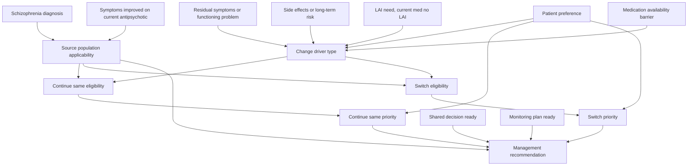

# Topic BN Output Package

## Topic

APA Statement 6: continuing the same antipsychotic medication in patients with schizophrenia whose symptoms have improved.

## Clinical decision point

For a patient with schizophrenia whose symptoms have improved on a current antipsychotic medication, should the management plan favor continuing the same antipsychotic medication, or should a medication change be considered because of residual symptoms, functioning problems, side effects, long-term risk, LAI needs, availability, or patient preference?

This is a qualitative Bayesian Network (BN) design. It uses source-backed structure and placeholder CPTs. It is not a calibrated clinical prediction model and should not generate autonomous treatment orders.

## Source boundary and implementation caution

The supplied APA text states that this guideline statement is a suggestion and is "not appropriate for use as a quality measure or for electronic decision support." For this app, the BN should therefore be used as a transparent decision-support artifact that surfaces rationale, contraindication/risk flags, and shared-decision prompts. Medication changes should require clinician review.

## Source-derived decision rules

| ID | Rule | Source support |
|---|---|---|
| R1 | The BN applies when the patient has schizophrenia and symptoms have improved with an antipsychotic medication. | APA Statement 6 recommendation and implementation text. |
| R2 | For most source-applicable patients, continuing the same antipsychotic is preferred. | "APA suggests (2B)..." and implementation text stating it is optimal for most patients. |
| R3 | A medication change may be considered when response is partial and significant symptoms or functional difficulty remain. | Implementation examples for changing medication. |
| R4 | A medication change may be considered to initiate an LAI antipsychotic if the current oral medication is not available in LAI formulation. | Implementation examples for changing medication. |
| R5 | A medication change may be considered for patient preference, medication availability, or side effects. | Implementation examples for changing medication. |
| R6 | Weight gain, diabetes, obesity, and metabolic syndrome are common reasons to discuss a medication change. | Implementation text and aripiprazole-switch RCT summary. |
| R7 | Continuing the same medication can carry long-term harms depending on side-effect profile, including metabolic effects or tardive syndromes. | Harms section. |
| R8 | Switching antipsychotics is associated with earlier or higher treatment discontinuation and possible clinical destabilization; this lowers switch priority when there is no clear change driver. | CATIE and Stroup trial summaries; benefits/harms text. |
| R9 | If a switch is undertaken, benefits and risks should be reviewed with the patient; family/support persons may be included; careful monitoring is essential. | Shared decision-making and switching approach text. |
| R10 | Gradual cross-taper is typical when changing antipsychotics, although limited studies do not show clear differences between switching approaches. | Implementation text on changing antipsychotic medications. |

## Node inventory

| Node ID | Type | States | Meaning |
|---|---|---|---|
| schizophrenia_dx | Patient state | yes; no; unknown | Whether the patient has schizophrenia. |
| symptom_response_current_ap | Patient state | improved; not_improved_or_unclear; unknown | Whether symptoms have improved on the current antipsychotic. |
| source_population_applicability | Gate | applicable; not_applicable; unknown | Whether Statement 6 should drive this BN. |
| residual_symptoms_functioning | Patient state | none_or_mild; significant; unknown | Ongoing symptoms or impaired functioning despite some response. |
| side_effect_driver | Patient state | none_or_mild; metabolic_weight_diabetes_metabolic_syndrome; tardive_or_other_serious; unknown | Side effects or long-term adverse-effect risk relevant to switching. |
| lai_need_current_no_lai | Patient state | no; yes; unknown | Need for LAI when current oral antipsychotic lacks an LAI formulation. |
| medication_availability_barrier | Patient state | no; yes; unknown | Current medication unavailable or difficult to continue for access/formulary reasons. |
| patient_preference_current_med | Patient state | prefers_continue_or_neutral; prefers_change; anxious_about_change; unknown | Patient preference or concern about continuing/changing. |
| change_driver_type | Derived clinical state | none; residual_or_functioning; side_effect_or_long_term_risk; lai_access; preference_or_availability; multiple; unknown | Dominant source-backed reason to consider changing medication. |
| continue_same_eligibility | Intervention eligibility | eligible; relative_caution; not_source_applicable; unknown | Whether continuing the same medication is medically allowed in this source context. |
| switch_medication_eligibility | Intervention eligibility | eligible_with_caution; defer_no_clear_driver; not_source_applicable; unknown | Whether changing medication is allowable and source-supported. |
| continue_same_priority | Intervention priority | high; moderate; low; unknown | Priority of continuing the same antipsychotic. |
| switch_medication_priority | Intervention priority | high; moderate; low; unknown | Priority of considering or performing a medication switch. |
| shared_decision_ready | Patient/process state | yes; no; unknown | Whether benefits, harms, recovery goals, and preferences have been reviewed. |
| monitoring_plan_ready | Patient/process state | yes; no; unknown | Whether careful monitoring for adherence, destabilization, and emerging side effects is planned. |
| management_recommendation | Management recommendation | not_source_applicable_use_other_pathway; continue_same_antipsychotic_with_routine_monitoring; continue_same_with_targeted_side_effect_management_and_reassessment; discuss_medication_change_in_shared_decision_making; change_antipsychotic_with_careful_monitoring_and_cross_taper; change_to_lai_available_antipsychotic_with_monitoring; obtain_more_information_or_clinical_reassessment | Final ranked action pattern. |

## Edges

| Parent | Child | Rationale |
|---|---|---|
| schizophrenia_dx | source_population_applicability | Diagnosis defines whether Statement 6 applies. |
| symptom_response_current_ap | source_population_applicability | Statement applies after symptom improvement. |
| residual_symptoms_functioning | change_driver_type | Residual symptoms/functioning problems may justify a trial of a different medication. |
| side_effect_driver | change_driver_type | Side effects and long-term risks may justify a medication change discussion. |
| lai_need_current_no_lai | change_driver_type | LAI need can justify changing when current medication has no LAI formulation. |
| medication_availability_barrier | change_driver_type | Medication availability may justify change. |
| patient_preference_current_med | change_driver_type | Preference may justify continuing or changing. |
| source_population_applicability | continue_same_eligibility | Outside the source population, Statement 6 should not recommend continuation. |
| source_population_applicability | switch_medication_eligibility | Outside the source population, Statement 6 should not recommend switching. |
| change_driver_type | continue_same_eligibility | Significant change drivers create relative caution for simply continuing unchanged. |
| change_driver_type | switch_medication_eligibility | Clear change drivers support switch eligibility with caution. |
| continue_same_eligibility | continue_same_priority | Eligibility constrains priority. |
| switch_medication_eligibility | switch_medication_priority | Eligibility constrains priority. |
| patient_preference_current_med | continue_same_priority | Preference/anxiety about change affects continuation priority. |
| patient_preference_current_med | switch_medication_priority | Preference for change affects switch priority. |
| shared_decision_ready | management_recommendation | Source requires benefit/harm review and shared decision-making for changes. |
| monitoring_plan_ready | management_recommendation | Source requires careful monitoring if a switch is undertaken. |
| continue_same_priority | management_recommendation | Drives recommendation toward continuation. |
| switch_medication_priority | management_recommendation | Drives recommendation toward discussing or performing change. |
| source_population_applicability | management_recommendation | Gate for source applicability. |

## Hard contraindication gates

No absolute intervention-specific medical contraindication is stated in the supplied source. The BN uses an applicability gate instead:

- If schizophrenia_dx = no, output not_source_applicable_use_other_pathway.
- If symptom_response_current_ap = not_improved_or_unclear, output not_source_applicable_use_other_pathway or obtain_more_information_or_clinical_reassessment, because the source statement is specifically about patients whose symptoms improved.

## Relative risk factors

| Risk factor | Effect in BN |
|---|---|
| Significant metabolic effects, diabetes, metabolic syndrome, obesity, or weight gain | Downgrades unchanged continuation and increases switch-discussion priority. |
| Tardive syndrome or other serious long-term adverse-effect concern | Downgrades unchanged continuation and increases switch-discussion priority. |
| No clear change driver | Downgrades switching because switching is associated with higher discontinuation risk. |
| Patient anxiety about change or preference to continue | Increases continuation priority unless major clinical risk is present. |
| No shared decision-making review | Prevents direct switch recommendation; output should be discuss_medication_change_in_shared_decision_making. |
| No monitoring plan | Prevents direct switch recommendation; output should require monitoring setup first. |

## Recommendation logic

| Clinical pattern | Preferred output |
|---|---|
| Source not applicable | not_source_applicable_use_other_pathway |
| Applicable, no clear change driver | continue_same_antipsychotic_with_routine_monitoring |
| Applicable, side effects present but shared decision/monitoring not ready | discuss_medication_change_in_shared_decision_making |
| Applicable, metabolic or serious long-term adverse-effect driver and process ready | change_antipsychotic_with_careful_monitoring_and_cross_taper |
| Applicable, residual symptoms/functioning problem and process ready | change_antipsychotic_with_careful_monitoring_and_cross_taper |
| Applicable, LAI needed and current medication has no LAI formulation | change_to_lai_available_antipsychotic_with_monitoring |
| Applicable, patient preference or availability issue without urgent clinical driver | discuss_medication_change_in_shared_decision_making |
| Unknown diagnosis, response, driver, preference, or monitoring status | obtain_more_information_or_clinical_reassessment |

## Placeholder CPT strategy

Root patient-state nodes should start with neutral or site-specific priors until calibrated from local data. The only deterministic placeholder in the first-pass BN is the source applicability gate:

- schizophrenia_dx = yes and symptom_response_current_ap = improved -> source_population_applicability = applicable.
- schizophrenia_dx = no -> source_population_applicability = not_applicable.
- symptom_response_current_ap = not_improved_or_unclear -> source_population_applicability = not_applicable.
- Any unknown parent without contradictory known data -> source_population_applicability = unknown.

Derived nodes use deterministic or near-deterministic placeholders:

- change_driver_type = none when all driver inputs are absent/none and known.
- change_driver_type = the single positive driver when exactly one source-backed driver is present.
- change_driver_type = multiple when more than one driver is present.
- change_driver_type = unknown when no positive driver is known but at least one driver input is unknown.

Recommendation CPTs should initially be deterministic action-pattern mappings from source_population_applicability, continue_same_priority, switch_medication_priority, shared_decision_ready, and monitoring_plan_ready. Numeric probabilities should remain placeholders until clinical governance validates weights and local calibration data are available.

## Mermaid diagram

## Rationale labels

| Label | Text |
|---|---|
| RL-default-continue | APA suggests continuing the same antipsychotic after symptom improvement; continuation is optimal for most patients. |
| RL-switch-risk | Switching antipsychotics is associated with earlier or higher treatment discontinuation and possible destabilization. |
| RL-switch-side-effects | Significant side effects, especially metabolic or long-term adverse effects, may justify discussing a change. |
| RL-switch-residual | Significant residual symptoms or functioning difficulty may justify a trial of a different medication. |
| RL-switch-lai | Need for an LAI may justify changing if the current oral antipsychotic has no LAI formulation. |
| RL-shared-decision | Benefits, harms, recovery goals, and preferences should be reviewed with the patient, and support persons may be included. |
| RL-monitoring | If switching occurs, careful monitoring is essential to avoid reduced adherence and clinical destabilization. |
| RL-source-caution | The source itself cautions that this suggestion is not appropriate as a quality measure or electronic decision support rule. |

## Governance notes for CDS implementation

1. Display this BN as advisory and source-explanatory, not as an automatic medication-ordering rule.
2. Require clinician confirmation for source_population_applicability.
3. Require explicit documentation of shared_decision_ready before a switch recommendation can move from "discuss" to "change".
4. Require monitoring_plan_ready for any switch action pattern.
5. Surface RL-source-caution in model documentation and governance review.
6. Treat unknown patient states as unknown, not as negative findings.

