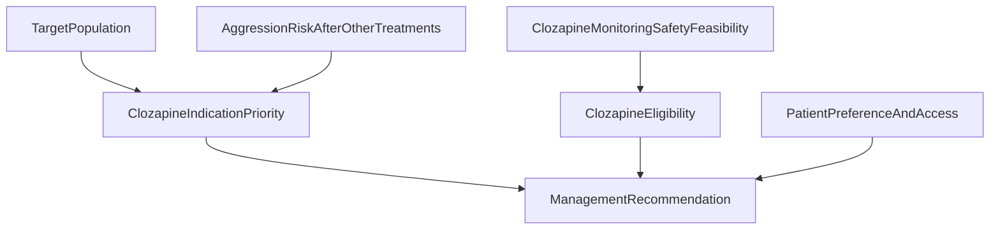

# Bayesian Network: Clozapine in Aggressive Behavior

## Clinical Decision Point

For a patient in the schizophrenia target population, should clozapine be initiated or offered when risk for aggressive behavior remains substantial despite other treatments?

This is a qualitative first-pass Bayesian Network for a clinical decision support app. Numeric probabilities are placeholders for later expert calibration and validation.

## Source Basis

Primary source passage: APA Practice Guideline for the Treatment of Patients With Schizophrenia, Statement 9, "Clozapine in Aggressive Behavior."

Guideline statement: APA suggests (2C) that patients with schizophrenia be treated with clozapine if the risk for aggressive behavior remains substantial despite other treatments, implemented in the context of a person-centered treatment plan with evidence-based nonpharmacological and pharmacological treatments.

Evidence strength: low overall strength of research evidence for efficacy in substantial aggression risk; benefits judged likely to outweigh harms when patient preferences and careful monitoring are considered.

## Source-Derived Decision Rules

1. Clozapine is favored when the patient is in the schizophrenia target population and risk for aggressive behavior remains substantial despite other treatments.
2. If other treatments, adherence assessment, or modifiable aggression risk factors have not been adequately addressed, the preferred action is to optimize these elements and reassess clozapine need.
3. Clozapine should be considered only with required ANC monitoring and attention to serious adverse effects, including severe neutropenia, myocarditis, cardiomyopathy, neuroleptic malignant syndrome, seizures, constipation/ileus, metabolic effects, sedation, tachycardia, fever, dizziness, sialorrhea, and weight gain.
4. If required monitoring, safety evaluation, or logistical access to blood work is not feasible, the clozapine decision should shift toward resolving those barriers before initiation.
5. Patient concerns about blood work, transport, weight gain, and somnolence should influence shared decision-making; acceptance or openness supports offering clozapine when indication and eligibility are favorable.
6. If aggression risk is not substantial, is controlled, or the patient is outside the target population, clozapine for aggression is not currently prioritized by this statement.

## Node Inventory

| Node | Type | States | Source role |
|---|---|---|---|
| `TargetPopulation` | Patient state | `schizophrenia_target_population`, `outside_statement_scope`, `unknown` | Statement applies to patients with schizophrenia; trials include schizophrenia spectrum, but guideline recommendation is schizophrenia-specific. |
| `AggressionRiskAfterOtherTreatments` | Patient state | `substantial_despite_other_treatments`, `not_substantial_or_controlled`, `insufficient_other_treatment_or_adherence_assessment`, `unknown` | Core indication condition from Statement 9 and implementation text. |
| `ClozapineMonitoringSafetyFeasibility` | Intervention eligibility input | `feasible_no_serious_barrier`, `feasible_with_relative_risk`, `barrier_or_required_monitoring_unavailable`, `unknown` | Encodes required ANC monitoring, cardiac/NMS/seizure/constipation/metabolic/sedation cautions, and access barriers. |
| `PatientPreferenceAndAccess` | Patient state | `accepts_or_prefers`, `concerns_but_open_with_support`, `declines_or_refuses`, `unknown` | Source notes patient acceptance, reluctance due to blood work/logistics, and concerns about adverse effects. |
| `ClozapineIndicationPriority` | Intervention priority node | `high_priority`, `optimize_first_then_reassess`, `low_priority`, `unknown` | Derived priority for clozapine based on target population and aggression persistence despite other treatments. |
| `ClozapineEligibility` | Intervention eligibility node | `eligible`, `eligible_with_caution`, `not_eligible_now`, `unknown` | Derived eligibility based on monitoring/safety feasibility. |
| `ManagementRecommendation` | Management recommendation | `offer_clozapine_with_required_monitoring`, `optimize_adherence_modifiable_risks_then_reassess`, `resolve_safety_monitoring_access_or_preference_barriers`, `no_clozapine_currently_continue_person_centered_care`, `obtain_missing_structured_information` | Final ranked action pattern. |

## Edges

| Parent | Child | Rationale |
|---|---|---|
| `TargetPopulation` | `ClozapineIndicationPriority` | Recommendation applies to schizophrenia target population. |
| `AggressionRiskAfterOtherTreatments` | `ClozapineIndicationPriority` | Clozapine is suggested if aggression risk remains substantial despite other treatments. |
| `ClozapineMonitoringSafetyFeasibility` | `ClozapineEligibility` | Harms cannot be eliminated; ANC monitoring and early recognition of serious adverse effects reduce risk. |
| `ClozapineIndicationPriority` | `ManagementRecommendation` | High priority supports offering clozapine; incomplete prior treatment/adherence work supports optimization first. |
| `ClozapineEligibility` | `ManagementRecommendation` | Monitoring/safety barriers prevent immediate initiation. |
| `PatientPreferenceAndAccess` | `ManagementRecommendation` | Patient acceptance, blood work burden, transport barriers, and adverse-effect concerns affect actionability. |

## Hard Contraindication Gates

No formal absolute contraindication is explicitly stated in the supplied passage. For decision-support safety, this BN uses a conservative operational hard gate:

| Gate | Trigger state | Effect |
|---|---|---|
| Required monitoring or serious safety barrier | `ClozapineMonitoringSafetyFeasibility = barrier_or_required_monitoring_unavailable` | `ClozapineEligibility = not_eligible_now`; final recommendation favors resolving monitoring/safety/access barriers before clozapine. |

This gate is source-grounded in the requirement for ANC monitoring and the guideline's emphasis on early recognition and monitoring for serious clozapine harms. It should be reviewed by clinical governance before production use.

## Relative Risk Factors

The following are encoded inside `ClozapineMonitoringSafetyFeasibility = feasible_with_relative_risk` rather than as separate outcome tradeoff nodes:

| Relative risk factor | Source basis | BN effect |
|---|---|---|
| Seizure risk or rapid clozapine level shifts | Seizures are more frequent with clozapine; risk minimized by slow titration, avoiding very high doses, and attention to pharmacokinetic factors. | Eligibility becomes `eligible_with_caution`. |
| Constipation, fecal impaction, or ileus concern | Constipation can be significant and associated with fecal impaction or paralytic ileus. | Eligibility becomes `eligible_with_caution` unless severe barrier is present. |
| Cardiac/NMS concern needing evaluation | Myocarditis, cardiomyopathy, and NMS are rare but serious; early recognition may reduce risk. | If active/suspected barrier, `not_eligible_now`; otherwise caution. |
| Weight gain, sedation, metabolic concerns | Source notes weight gain, sedation, hyperglycemia, and diabetes may be increased. | Preference/access and caution may downgrade recommendation. |
| Blood work or transportation burden | Source notes required blood work and logistical barriers such as transportation. | May move recommendation to barrier resolution before initiation. |

## Recommendation Semantics

| Recommendation state | Clinical action pattern |
|---|---|
| `offer_clozapine_with_required_monitoring` | Offer/initiate clozapine in a person-centered treatment plan with required ANC monitoring, side-effect monitoring, careful titration, and shared decision-making. |
| `optimize_adherence_modifiable_risks_then_reassess` | Address adherence, modifiable aggression risk factors, and evidence-based nonpharmacological/pharmacological treatments before deciding that aggression risk persists despite other treatments. |
| `resolve_safety_monitoring_access_or_preference_barriers` | Do not start immediately; resolve ANC monitoring feasibility, safety workup, transport/access barriers, or patient preference concerns. |
| `no_clozapine_currently_continue_person_centered_care` | Clozapine for aggression is not currently prioritized; continue person-centered schizophrenia care and reassess if substantial risk emerges. |
| `obtain_missing_structured_information` | Obtain structured information on diagnosis, aggression risk, prior treatments, adherence, monitoring feasibility, and patient preferences. |

## Placeholder CPT Strategy

Root node priors are neutral placeholders. Intermediate nodes use directional placeholder CPTs reflecting the source-derived rules. These values are not validated probabilities and should be recalibrated with expert elicitation and empirical data.

Deterministic-like behavior is used only for the operational hard gate: unavailable required monitoring or active serious safety barrier strongly drives `ClozapineEligibility = not_eligible_now`.

## Mermaid Diagram

## Implementation Notes

- This BN intentionally does not estimate the probability of aggression reduction, hospitalization reduction, suicide reduction, or adverse events; those would be outcome tradeoff nodes and are outside the qualitative BN scope defined in the project context.
- This BN does not replace clozapine initiation protocols. It only identifies when clozapine should be considered, deferred, or not prioritized for aggression risk under Statement 9.
- Production deployment should link this BN to a separate clozapine safety/monitoring protocol module covering ANC thresholds, myocarditis surveillance, constipation monitoring, metabolic monitoring, drug interactions, and dose titration.

