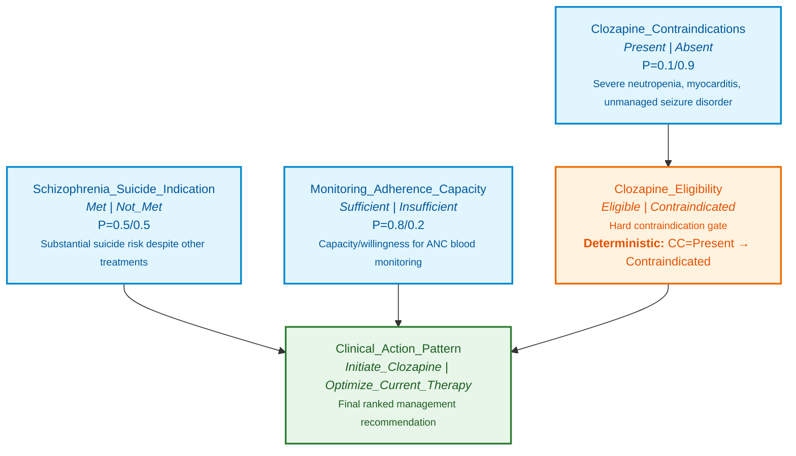

# Clozapine in Suicide Risk — Bayesian Network

## Clinical Decision Point

For a patient with schizophrenia and substantial suicide risk despite other treatments, should clozapine be initiated or should current therapy be optimized instead?

Clozapine is the only antipsychotic with evidence for reducing suicidal behavior in schizophrenia, but it carries hard contraindications and mandatory blood-monitoring requirements that gate its use.

---

## Node Inventory

### Patient State Nodes

| Node | States | Description |
|------|--------|-------------|
| `Schizophrenia_Suicide_Indication` | `Met`, `Not_Met` | Patients with schizophrenia possessing substantial suicide risk despite other treatments. |
| `Clozapine_Contraindications` | `Present`, `Absent` | Presence of severe neutropenia, history of clozapine-induced myocarditis, or unmanaged seizure disorder. |
| `Monitoring_Adherence_Capacity` | `Sufficient`, `Insufficient` | Patient capacity and willingness to adhere to mandatory ANC blood monitoring. |

### Intervention Eligibility Node

| Node | States | Description |
|------|--------|-------------|
| `Clozapine_Eligibility` | `Eligible`, `Contraindicated` | Hard contraindication gate determining overall clinical eligibility. |

### Intervention Recommendation Node

| Node | States | Description |
|------|--------|-------------|
| `Clinical_Action_Pattern` | `Initiate_Clozapine`, `Optimize_Current_Therapy` | Final ranked management recommendation. |

---

## Structure (Edges)

| From | To | Type |
|------|----|------|
| `Clozapine_Contraindications` | `Clozapine_Eligibility` | Hard contraindication gate |
| `Schizophrenia_Suicide_Indication` | `Clinical_Action_Pattern` | Clinical priority |
| `Clozapine_Eligibility` | `Clinical_Action_Pattern` | Eligibility input |
| `Monitoring_Adherence_Capacity` | `Clinical_Action_Pattern` | Clinical priority |

---

## Contraindication Gate

`Clozapine_Eligibility` is a **hard contraindication gate** — a deterministic node driven solely by `Clozapine_Contraindications`. If any contraindication is `Present`, the patient is `Contraindicated` regardless of other favorable factors, and clozapine cannot be recommended.

| `Clozapine_Contraindications` | `Clozapine_Eligibility` |
|------------------------------|-------------------------|
| `Present` | `Contraindicated` (1.0) |
| `Absent` | `Eligible` (1.0) |

---

## Management Recommendation Logic

`Clinical_Action_Pattern` is a deterministic function of `Schizophrenia_Suicide_Indication`, `Clozapine_Eligibility`, and `Monitoring_Adherence_Capacity`. Clozapine is initiated **only when all three conditions are favorable**; in every other combination, current therapy is optimized instead.

| # | Suicide Indication | Eligibility | Monitoring Adherence | Recommendation |
|---|-------------------|-------------|---------------------|-----------------|
| 1 | `Met` | `Eligible` | `Sufficient` | **Initiate_Clozapine** |
| 2 | `Met` | `Eligible` | `Insufficient` | Optimize_Current_Therapy |
| 3 | `Met` | `Contraindicated` | `Sufficient` | Optimize_Current_Therapy |
| 4 | `Met` | `Contraindicated` | `Insufficient` | Optimize_Current_Therapy |
| 5 | `Not_Met` | `Eligible` | `Sufficient` | Optimize_Current_Therapy |
| 6 | `Not_Met` | `Eligible` | `Insufficient` | Optimize_Current_Therapy |
| 7 | `Not_Met` | `Contraindicated` | `Sufficient` | Optimize_Current_Therapy |
| 8 | `Not_Met` | `Contraindicated` | `Insufficient` | Optimize_Current_Therapy |

### Rationale Labels

- **Initiate_Clozapine** — Indicated only when suicide-risk indication is met, no hard contraindication is present, and the patient can sustain mandatory ANC monitoring. Clozapine is the only antipsychotic with demonstrated reduction in suicidal behavior in schizophrenia.
- **Optimize_Current_Therapy** — Chosen in every other scenario: when the indication is absent, when a contraindication excludes clozapine, or when monitoring adherence is insufficient to meet the REMS-style ANC requirement.

---

## Probability Tables

> **Note:** This is a **qualitative Bayesian Network**. Root node priors are neutral placeholders (0.5) except where a documented baseline rate is cited (contraindication prevalence, monitoring adherence). Gate and recommendation CPTs are deterministic by design and carry validated entries. All non-deterministic priors should be replaced with calibrated values before clinical use.

### `Schizophrenia_Suicide_Indication` (root)

| Met | Not_Met |
|-----|---------|
| 0.5 | 0.5 |

### `Clozapine_Contraindications` (root)

| Present | Absent |
|---------|--------|
| 0.1 | 0.9 |

### `Monitoring_Adherence_Capacity` (root)

| Sufficient | Insufficient |
|------------|--------------|
| 0.8 | 0.2 |

### `Clozapine_Eligibility` | `Clozapine_Contraindications`

| Contraindications | P(Eligible) | P(Contraindicated) |
|-------------------|-------------|--------------------|
| Present | 0.0 | 1.0 |
| Absent | 1.0 | 0.0 |

### `Clinical_Action_Pattern` | `Schizophrenia_Suicide_Indication`, `Clozapine_Eligibility`, `Monitoring_Adherence_Capacity`

Row order follows `(Schizophrenia_Suicide_Indication, Clozapine_Eligibility, Monitoring_Adherence_Capacity)` with the first state listed for each parent.

| Row | SSI | CE | MAC | P(Initiate_Clozapine) | P(Optimize_Current_Therapy) |
|----|-----|----|-----|-----------------------|-----------------------------|
| 1 | Met | Eligible | Sufficient | 1.0 | 0.0 |
| 2 | Met | Eligible | Insufficient | 0.0 | 1.0 |
| 3 | Met | Contraindicated | Sufficient | 0.0 | 1.0 |
| 4 | Met | Contraindicated | Insufficient | 0.0 | 1.0 |
| 5 | Not_Met | Eligible | Sufficient | 0.0 | 1.0 |
| 6 | Not_Met | Eligible | Insufficient | 0.0 | 1.0 |
| 7 | Not_Met | Contraindicated | Sufficient | 0.0 | 1.0 |
| 8 | Not_Met | Contraindicated | Insufficient | 0.0 | 1.0 |

---

## Files

| File | Description |
|------|-------------|
| `BN-Clozapine-in-Suicide-Risk.xml` | Machine-readable BN spec (BIF 0.3 XML) with nodes, states, edges, and CPTs. |
| `Diagram-Clozapine-in-Suicide-Risk.mmd` | Mermaid diagram source for the network structure. |
| `README-Clozapine-in-Suicide-Risk.md` | This document. |
