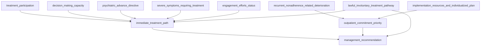

# BN-Involuntary-Treatment-Considerations

## Overview

**`BN-Involuntary-Treatment-Considerations.xml`** is a Bayesian Network (BN) encoded in the [Bayesian Interchange Format (BIF)](http://www.cs.cmu.edu/~javabayes/Documentation/Papers/bif-format.txt) (`.xml` extension). It models the clinical decision process for **involuntary treatment considerations** in patients with severe mental illness — balancing patient autonomy and self-determination against clinical need, capacity, prior preferences, lawful pathway, and (for a small subgroup) involuntary outpatient commitment.

The network is named `involuntary_treatment_considerations_bn` and contains **11 variables** organized into three logical tiers:

1. **Patient state variables** — observed or assessed clinical and jurisdictional conditions (treatment participation, decision-making capacity, psychiatric advance directive, severe symptoms, engagement efforts status, lawful involuntary treatment pathway, recurrent nonadherence-related deterioration, implementation resources and individualized plan).
2. **Intermediate decision variables** — reasoning nodes that integrate patient states into decision priorities (immediate treatment path, outpatient commitment priority).
3. **Management recommendation** — the terminal decision node producing the final involuntary-treatment recommendation.

## File Format

| Property | Value |
|---|---|
| Format | BIF v0.3 (`<BIF VERSION="0.3">`) |
| Schema | Referenced via `XSD.xml` (`xsi:noNamespaceSchemaLocation`) |
| Encoding | UTF-8 |
| Parser compatibility | [JavaBayes](http://www.cs.cmu.edu/~javabayes/), or any BIF-compatible BN toolbox |

## Network Structure



## Variables

### Tier 1 — Patient State Variables (no parents)

These eight nodes are root variables with uniform prior probability tables in the current file (to be replaced by elicited or learned priors). Each represents an assessed clinical or jurisdictional condition.

| Variable | Outcomes |
|---|---|
| `treatment_participation` | `accepts_treatment`, `declines_or_resists_treatment`, `unknown` |
| `decision_making_capacity` | `has_capacity`, `lacks_capacity`, `unknown` |
| `psychiatric_advance_directive` | `available_and_applicable`, `absent_or_not_applicable`, `unknown` |
| `severe_symptoms_requiring_treatment` | `present`, `absent`, `unknown` |
| `engagement_efforts_status` | `accepted_after_psychotherapeutic_or_support_engagement`, `not_accepted_despite_engagement`, `not_yet_attempted`, `unknown` |
| `lawful_involuntary_treatment_pathway` | `administrative_process_available`, `judicial_hearing_required`, `no_pathway_or_criteria_not_met`, `unknown` |
| `recurrent_nonadherence_related_deterioration` | `repeated_relapse_rehospitalization_or_reincarceration`, `pattern_absent`, `unknown` |
| `implementation_resources_and_individualized_plan` | `adequate`, `inadequate`, `unknown` |

**Properties (clinical notes embedded in the BIF):**

- `treatment_participation` — Patient willingness to participate in treatment or take medication.
- `decision_making_capacity` — Current capacity to participate in treatment decision-making.
- `psychiatric_advance_directive` — Previously stated treatment preferences may guide choices during later incapacity.
- `severe_symptoms_requiring_treatment` — Severe symptoms and a clinical requirement for treatment.
- `engagement_efforts_status` — Psychotherapeutic interactions should identify distressing symptoms previously responsive to treatment; family and support persons may encourage engagement.
- `lawful_involuntary_treatment_pathway` — Prevailing jurisdictional law determines whether involuntary medication can use a state process or requires judicial permission.
- `recurrent_nonadherence_related_deterioration` — Repeated adverse episodes associated with nonadherence or impaired insight identify the small subgroup for whom outpatient commitment may be considered.
- `implementation_resources_and_individualized_plan` — Effective outpatient commitment implementation requires adequate resources and individualized treatment planning.

### Tier 2 — Intermediate Decision Variables

Each of these integrates its parents into an intermediate decision state. In the current file the conditional probability tables (CPTs) are placeholders (row-wise uniform for `immediate_treatment_path`; partially structured for `outpatient_commitment_priority`); they declare the dependency structure and should be populated with elicited/learned CPTs.

| Variable | Parents | Outcomes |
|---|---|---|
| `immediate_treatment_path` | `treatment_participation`, `decision_making_capacity`, `psychiatric_advance_directive`, `severe_symptoms_requiring_treatment`, `engagement_efforts_status`, `lawful_involuntary_treatment_pathway` | `continue_voluntary_collaborative_treatment`, `follow_advance_directive_and_reassess`, `pursue_lawful_involuntary_process`, `defer_involuntary_treatment_continue_engagement`, `insufficient_information` |
| `outpatient_commitment_priority` | `recurrent_nonadherence_related_deterioration`, `implementation_resources_and_individualized_plan` | `consider_with_ethical_balancing`, `do_not_prioritize`, `insufficient_information` |

**Properties:**

- `immediate_treatment_path` — Preserve autonomy through voluntary engagement or applicable prior preferences; use involuntary treatment only when incapacity, treatment need, and a lawful pathway support it.
- `outpatient_commitment_priority` — Outpatient commitment may enter the plan for the recurrent nonadherence-related deterioration subgroup when implementation resources are adequate, balancing autonomy and best interest.

### Tier 3 — Management Recommendation (terminal node)

| Variable | Parents | Outcomes |
|---|---|---|
| `management_recommendation` | `immediate_treatment_path`, `outpatient_commitment_priority`, `lawful_involuntary_treatment_pathway` | `voluntary_treatment_with_psychotherapeutic_and_support_engagement`, `follow_applicable_advance_directive_with_capacity_and_clinical_reassessment`, `initiate_state_authorized_involuntary_treatment_process`, `seek_judicial_permission_before_involuntary_treatment`, `consider_involuntary_outpatient_commitment_with_resources_individualized_plan_and_ethical_review`, `insufficient_information_verify_capacity_need_preferences_and_local_law` |

**Property:** Final ranked clinical action pattern for involuntary treatment considerations.

## Probability Tables

The current CPTs are **placeholder distributions** intended to encode the dependency structure; they are not calibrated to clinical evidence. `immediate_treatment_path` and `management_recommendation` use row-wise uniform vectors; `outpatient_commitment_priority` uses a partially structured distribution that encodes the directional intent (consider when both deterioration pattern is present and resources are adequate; do not prioritize otherwise) but should still be calibrated before clinical use. A summary of the table shapes:

| Variable | Parents | # Rows | # Columns |
|---|---|---:|---:|
| `treatment_participation` | — | 1 | 3 |
| `decision_making_capacity` | — | 1 | 3 |
| `psychiatric_advance_directive` | — | 1 | 3 |
| `severe_symptoms_requiring_treatment` | — | 1 | 3 |
| `engagement_efforts_status` | — | 1 | 4 |
| `lawful_involuntary_treatment_pathway` | — | 1 | 4 |
| `recurrent_nonadherence_related_deterioration` | — | 1 | 3 |
| `implementation_resources_and_individualized_plan` | — | 1 | 3 |
| `immediate_treatment_path` | 6 (3×3×3×3×4×4 combos) | 1296 | 5 |
| `outpatient_commitment_priority` | 2 (3×3 combos) | 9 | 3 |
| `management_recommendation` | 3 (5×3×4 combos) | 60 | 6 |

> **Note:** The BIF file as currently written stores the conditional definitions as a single flat vector per definition (the parent-conditioned rows are collapsed). When populating the CPTs with real values, ensure the table length matches `(#parent-state combinations) × (#child states)` and that the ordering of entries follows the BIF convention (rightmost parent iterates fastest).

## Clinical Interpretation

The decision logic follows the involuntary-treatment reasoning typically presented in schizophrenia care guidelines, structured around preserving autonomy unless capacity, need, and lawful pathway converge:

1. **Can voluntary engagement work?** (`immediate_treatment_path`) — Integrates treatment participation, capacity, advance directive, severe symptom need, engagement efforts, and the lawful pathway. If the patient accepts treatment (directly or after psychotherapeutic/support engagement), continue voluntary collaborative treatment. If an applicable psychiatric advance directive exists, follow it and reassess capacity and clinical state.
2. **Is involuntary treatment lawful and necessary?** — If the patient lacks capacity but requires treatment, the prevailing jurisdictional law determines the route: an administrative/state process or a judicial hearing. If no pathway or criteria are met, defer involuntary treatment and continue engagement.
3. **Does the patient fit the outpatient commitment subgroup?** (`outpatient_commitment_priority`) — Restricted to the small subgroup with repeated relapse, rehospitalization, or reincarceration associated with nonadherence/impaired insight, *and* only when implementation resources and an individualized plan are adequate. Otherwise do not prioritize outpatient commitment.
4. **Final recommendation** (`management_recommendation`) — Integrates the immediate treatment path, outpatient commitment priority, and lawful pathway into one of six actionable management recommendations (or `insufficient_information_verify_capacity_need_preferences_and_local_law`).

## Usage

### Loading the network

The file can be loaded with any BIF-compatible Bayesian Network toolkit. Examples:

**JavaBayes (reference BIF parser):**
```sh
java -jar javabayes.jar
# In the shell: load BN-Involuntary-Treatment-Considerations.xml
```

**pgmpy (Python):**
```python
from pgmpy.readwrite import BIFReader

reader = BIFReader("BN-Involuntary-Treatment-Considerations.xml")
model = reader.get_model()
print(model.nodes())
print(model.edges())
```

**SMILE / BNLearn (R):**
```r
library(bnlearn)
net <- read.bif("BN-Involuntary-Treatment-Considerations.xml")
```

### Notes before clinical use

- The probability tables are placeholders and must be **elicited from domain experts** or **learned from data** before the network's outputs are clinically meaningful. The `outpatient_commitment_priority` CPT encodes directional intent but the values are not evidence-calibrated.
- The `unknown` outcome on each patient-state node provides an explicit path for insufficient information, routed through the `insufficient_information` outcomes of the intermediate nodes to the `insufficient_information_verify_capacity_need_preferences_and_local_law` management recommendation.
- The terminology aligns with the involuntary-treatment decision logic typically presented in schizophrenia care guidelines (capacity, advance directives, engagement efforts, jurisdictional pathway, recurrent nonadherence subgroup, outpatient commitment implementation, autonomy–best-interest balancing).
- Jurisdictional variation is significant: criteria and implementation of involuntary treatment and outpatient commitment vary across countries and, within the United States, across states. The `lawful_involuntary_treatment_pathway` node must be interpreted against the prevailing local statute before any recommendation is acted on.

## File Contents at a Glance

- **1 network** (`involuntary_treatment_considerations_bn`)
- **11 variables** (8 patient states, 2 intermediate decisions, 1 management recommendation)
- **11 directed edges** (dependency relationships)
- **11 CPTs** (8 root priors + 3 conditionals), placeholder distributions pending clinical and jurisdiction-specific calibration
