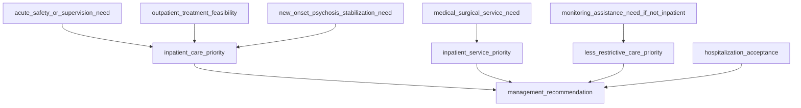

# BN-Treatment-Setting

## Overview

**`BN-Treatment-Setting.xml`** is a Bayesian Network (BN) encoded in the [Bayesian Interchange Format (BIF)](http://www.cs.cmu.edu/~javabayes/Documentation/Papers/bif-format.txt) (`.xml` extension). It models the clinical decision process for selecting the least restrictive **treatment setting** likely to be safe and effective for a patient with schizophrenia, while matching inpatient medical capability and favoring voluntary admission.

The network is named `schizophrenia_treatment_setting_bn` and contains **10 variables** organized into three logical tiers:

1. **Patient state variables** — observed or assessed clinical conditions (safety/supervision needs, outpatient feasibility, new-onset stabilization need, medical/surgical service need, monitoring assistance need, hospitalization acceptance).
2. **Clinical priority variables** — intermediate reasoning nodes that integrate patient states into decision priorities (inpatient care priority, inpatient service priority, less restrictive care priority).
3. **Management recommendation** — the terminal decision node producing the final treatment-setting recommendation.

## File Format

| Property | Value |
|---|---|
| Format | BIF v0.3 (`<BIF VERSION="0.3">`) |
| Schema | Referenced via `XSD.xml` (`xsi:noNamespaceSchemaLocation`) |
| Encoding | UTF-8 |
| Parser compatibility | [JavaBayes](http://www.cs.cmu.edu/~javabayes/), or any BIF-compatible BN toolbox |

## Network Structure



## Variables

### Tier 1 — Patient State Variables (no parents)

These six nodes are root variables with uniform prior probability tables in the current file (to be replaced by elicited or learned priors). Each represents an assessed clinical condition.

| Variable | Outcomes |
|---|---|
| `acute_safety_or_supervision_need` | `serious_threat_of_harm_to_self_or_others`, `unable_to_self_care_and_needs_constant_support`, `neither_present`, `unknown` |
| `outpatient_treatment_feasibility` | `unsafe_or_ineffective_due_to_psychiatric_problem`, `unsafe_or_ineffective_due_to_medical_problem`, `safe_and_effective`, `unknown` |
| `new_onset_psychosis_stabilization_need` | `initial_inpatient_stabilization_warranted`, `initial_inpatient_stabilization_not_warranted`, `unknown` |
| `medical_surgical_service_need` | `significant_intervention_or_monitoring_unavailable_on_psychiatric_service`, `manageable_on_psychiatric_service_with_medical_consultants`, `no_significant_additional_health_service_need`, `unknown` |
| `monitoring_assistance_need_if_not_inpatient` | `more_than_routine_outpatient_care`, `routine_outpatient_care_sufficient`, `unknown` |
| `hospitalization_acceptance` | `accepts_voluntary_hospitalization`, `does_not_accept_voluntary_hospitalization`, `unknown_or_not_yet_discussed` |

**Properties (clinical notes embedded in the BIF):**

- `acute_safety_or_supervision_need` — Usual hospitalization indications include serious threat of harm or inability to self-care with need for constant supervision or support.
- `outpatient_treatment_feasibility` — Psychiatric or medical problems can make outpatient treatment unsafe or ineffective.
- `new_onset_psychosis_stabilization_need` — New-onset psychosis may warrant inpatient stabilization to reduce acute symptoms and permit treatment engagement.
- `medical_surgical_service_need` — Significant medical or surgical needs and service capability determine whether a general hospital, intensive care, or psychiatric inpatient service is optimal.
- `monitoring_assistance_need_if_not_inpatient` — Enhanced outpatient programs are indicated when inpatient criteria are not met but routine outpatient monitoring or assistance is insufficient.
- `hospitalization_acceptance` — When inpatient care is essential, voluntary hospitalization should be pursued; applicable jurisdictional requirements govern involuntary hospitalization if essential care is refused.

### Tier 2 — Clinical Priority Variables

Each of these integrates its parents into a clinical decision priority. In the current file the conditional probability tables (CPTs) are placeholders (e.g., row-wise uniform). They declare the dependency structure but should be populated with elicited/learned CPTs.

| Variable | Parents | Outcomes |
|---|---|---|
| `inpatient_care_priority` | `acute_safety_or_supervision_need`, `outpatient_treatment_feasibility`, `new_onset_psychosis_stabilization_need` | `inpatient_care_essential`, `inpatient_care_not_indicated`, `insufficient_information` |
| `inpatient_service_priority` | `medical_surgical_service_need` | `general_hospital_or_intensive_care_with_consultation_liaison_psychiatry`, `psychiatric_inpatient_service_with_medical_consultants`, `standard_psychiatric_inpatient_service`, `insufficient_information` |
| `less_restrictive_care_priority` | `monitoring_assistance_need_if_not_inpatient` | `enhanced_outpatient_program`, `routine_outpatient_care`, `insufficient_information` |

**Properties:**

- `inpatient_care_priority` — Integrates safety, self-care, outpatient feasibility, and new-onset stabilization indications.
- `inpatient_service_priority` — Matches inpatient location to required medical or surgical capability.
- `less_restrictive_care_priority` — Selects enhanced versus routine outpatient care when inpatient treatment is not indicated.

### Tier 3 — Management Recommendation (terminal node)

| Variable | Parents | Outcomes |
|---|---|---|
| `management_recommendation` | `inpatient_care_priority`, `inpatient_service_priority`, `less_restrictive_care_priority`, `hospitalization_acceptance` | `voluntary_general_hospital_or_intensive_care_with_consultation_liaison_psychiatry`, `voluntary_psychiatric_inpatient_care_with_needed_medical_consultation`, `voluntary_standard_psychiatric_inpatient_care`, `follow_jurisdictional_requirements_for_involuntary_hospitalization_in_appropriate_inpatient_service`, `use_enhanced_outpatient_program_act_assisted_outpatient_intensive_outpatient_partial_or_day_hospitalization`, `use_routine_outpatient_care`, `insufficient_information_reassess_safety_feasibility_service_needs_and_acceptance` |

**Property:** Use the least restrictive setting likely to be safe and effective, while matching inpatient medical capability and favoring voluntary admission.

## Probability Tables

The current CPTs are **placeholder uniform distributions** intended to encode the dependency structure; they are not calibrated to clinical evidence. A summary of the table shapes:

| Variable | Parents | # Rows | # Columns |
|---|---|---:|---:|
| `acute_safety_or_supervision_need` | — | 1 | 4 |
| `outpatient_treatment_feasibility` | — | 1 | 4 |
| `new_onset_psychosis_stabilization_need` | — | 1 | 3 |
| `medical_surgical_service_need` | — | 1 | 4 |
| `monitoring_assistance_need_if_not_inpatient` | — | 1 | 3 |
| `hospitalization_acceptance` | — | 1 | 3 |
| `inpatient_care_priority` | 3 (4×4×3 combos) | 192 | 3 |
| `inpatient_service_priority` | 1 (4 combos) | 4 | 4 |
| `less_restrictive_care_priority` | 1 (3 combos) | 3 | 3 |
| `management_recommendation` | 4 (3×4×3×3 combos) | 108 | 7 |

> **Note:** The BIF file as currently written stores a single row per definition (the parent-conditioned rows are collapsed into a flat uniform vector). When populating the CPTs with real values, ensure the table length matches `(#parent-state combinations) × (#child states)` and that the ordering of entries follows the BIF convention (rightmost parent iterates fastest).

## Clinical Interpretation

The decision logic follows a "least restrictive effective setting" principle commonly used in psychiatric treatment-setting decisions:

1. **Is inpatient care essential?** (`inpatient_care_priority`) — Combines acute safety/supervision needs, outpatient feasibility, and new-onset psychosis stabilization need. If inpatient care is *essential* or *not indicated*, the pathway branches accordingly. `insufficient_information` triggers reassessment.
2. **If inpatient, which service?** (`inpatient_service_priority`) — Based on the medical/surgical service need, routes the patient to a general hospital/ICU (with consultation-liaison psychiatry), a psychiatric inpatient service (with medical consultants), or a standard psychiatric inpatient service.
3. **If not inpatient, how much outpatient support?** (`less_restrictive_care_priority`) — Based on the monitoring/assistance need, selects an enhanced outpatient program (ACT, assisted outpatient, intensive outpatient, partial/day hospitalization) versus routine outpatient care.
4. **Voluntary vs. involuntary** (`hospitalization_acceptance`) — If inpatient care is essential but the patient does not accept voluntary hospitalization, follow jurisdictional requirements for involuntary hospitalization in the appropriate inpatient service.
5. **Final recommendation** (`management_recommendation`) — Integrates the four inputs above into one of seven actionable management recommendations (or `insufficient_information_reassess…`).

## Usage

### Loading the network

The file can be loaded with any BIF-compatible Bayesian Network toolkit. Examples:

**JavaBayes (reference BIF parser):**
```sh
java -jar javabayes.jar
# In the shell: load BN-Treatment-Setting.xml
```

**pgmpy (Python):**
```python
from pgmpy.readwrite import BIFReader

reader = BIFReader("BN-Treatment-Setting.xml")
model = reader.get_model()
print(model.nodes())
print(model.edges())
```

**SMILE / BNLearn (R):**
```r
library(bnlearn)
net <- read.bif("BN-Treatment-Setting.xml")
```

### Notes before clinical use

- The probability tables are placeholders and must be **elicited from domain experts** or **learned from data** before the network's outputs are clinically meaningful.
- The `unknown` outcome on each patient-state node provides an explicit path for insufficient information, routed through the `insufficient_information` outcomes of the priority nodes to the `insufficient_information_reassess…` management recommendation.
- The terminology aligns with the treatment-setting decision logic typically presented in schizophrenia care guidelines (acute safety, outpatient feasibility, new-onset stabilization, medical comorbidity, least-restrictive alternative, voluntary vs. involuntary).

## File Contents at a Glance

- **1 network** (`schizophrenia_treatment_setting_bn`)
- **10 variables** (6 patient states, 3 clinical priorities, 1 management recommendation)
- **15 directed edges** (dependency relationships)
- **10 CPTs** (6 root priors + 4 conditionals), all currently uniform placeholder distributions
