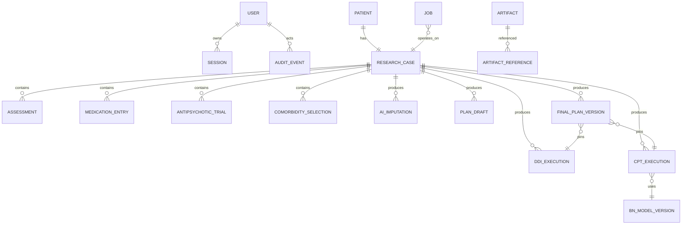

# INSIGHT Domain Model

## Aggregate boundaries

## Core entities

### User

- `id: UUID`
- `usernameNormalized: string` unique
- `passwordHash: string`
- `role: ADMINISTRATOR | PSYCHIATRIST`
- `status: ENABLED | DISABLED | PASSWORD_CHANGE_REQUIRED`
- timestamps

Every installation inserts enabled `admin/admin`. Password reset writes a temporary Argon2id hash, marks `PASSWORD_CHANGE_REQUIRED`, and revokes sessions.

### Session

- `id: UUID`
- `tokenHash: bytes` unique
- `userId`
- `createdAt`, `lastUsedAt`, `expiresAt`, `revokedAt`
- client/security metadata

The plaintext opaque token exists only in the hardened cookie.

### Patient

- `id: UUID`
- `officialIdentifierType`
- `officialIdentifierIssuer`
- `officialIdentifierNormalizedEncrypted`
- `officialIdentifierLookupHash`
- `firstNameEncrypted`, `lastNameEncrypted`
- `dateOfBirthEncrypted`
- `sex: MALE | FEMALE`
- audit timestamps/actors

Unique constraint: `(officialIdentifierType, officialIdentifierIssuer, officialIdentifierLookupHash)`.

Submitting a duplicate identifier automatically overwrites first name, last name, birth date, and sex on the existing Patient.

### ResearchCase

- `id: UUID`
- `patientId: UUID` unique
- `startedAt`
- `presentationStatus: FIRST_PRESENTATION | KNOWN_SCHIZOPHRENIA`
- `previouslyTreated: boolean | null`
- `workflowState`
- optimistic metadata but last-write-wins behavior

There is one Research Case per Patient and no Encounter table.

### Assessment

- `id`, `researchCaseId`
- `type: DSM5TR | PANSS | CSSRS_RECENT`
- `instrumentVersionId`
- `status: NOT_STARTED | IN_PROGRESS | COMPLETED | BYPASSED`
- structured answers
- deterministic result/score/band
- actor/timestamps

Bypass discards partial answers. AI-imputed values are never stored in this entity.

### AiImputation

- `id`, `researchCaseId`, `assessmentType`
- `status: AI_IMPUTED`
- hidden generated answers/scores/classification
- de-identified input fingerprint
- endpoint/model/prompt/schema/settings
- raw output/provenance
- `cptDependencyFingerprint`

The Primary Plan shows only a generic notice. Final plans and exports show no notice.

### MedicationEntry

- `id`, `researchCaseId`
- `kind: CURRENT | PROPOSED`
- raw text
- `normalizationState: NORMALIZED | UNKNOWN`
- canonical medication/catalog identifiers when normalized
- LLM normalization provenance
- optional dose/route/frequency

The LLM mapping is accepted automatically. `UNKNOWN` entries proceed without pairwise DDI coverage.

### AntipsychoticTrial

- `id`, `researchCaseId`
- required medication entry/mapping
- optional dose/unit and period
- optional response enum
- optional adverse-effect selections and `OTHER` detail
- optional discontinuation reason and notes

Only medication is required.

### ComorbiditySelection

- `researchCaseId`
- `catalogVersionId`, `termId`
- optional supplemental text

Deterministic knowledge rules, not free text alone, produce contraindication and routing effects.

### BnModelVersion

- stable pathway identity and immutable version
- source artifact reference/hash
- parsed graph/topology hash
- validation report
- evidence/calibration/clinical-review status
- lifecycle: `IMPORTED | REJECTED | ACTIVE | SUPERSEDED`

The newest structurally passing version activates automatically.

### CptExecution

- `id`, `researchCaseId`, `bnModelVersionId`
- dependency fingerprint
- endpoint/model/prompt/schema/settings
- up to three generation attempts and diagnostics
- accepted immutable full CPT snapshot
- deterministic inference result
- status and provenance

All patient context affects BN output through generated CPTs only. No evidence nodes are clamped.

### DdiExecution

- `id`, `researchCaseId`
- exact normalized regimen snapshot
- list of `UNKNOWN` omitted medicines/pairs
- DDI source version
- findings with severity/mechanism/effect/action/source
- status, timestamp, provenance

Findings are warning-only. Execution failure blocks finalization.

### PlanDraft

- versioned structured plan schema
- regimen items and supporting fields
- source execution references
- clinician edits
- generic AI-imputation notice flag
- mutable last-write-wins state

### FinalPlanVersion

- `id`, `researchCaseId`, sequence
- `status: ACTIVE | SUPERSEDED`
- predecessor reference
- immutable structured plan snapshot
- exact DDI/CPT/BN/assessment/source provenance
- finalizer and timestamp
- idempotency key unique per Research Case

Final versions contain no AI-imputation notice. Supersession requires no reason.

### Job

- typed payload reference and Research Case
- `QUEUED | RUNNING | SUCCEEDED | FAILED | CANCELLED`
- lease, attempts, progress, error, idempotency
- result/provenance reference

### Artifact

- `id`, module/owner classification
- relative volume path
- media type, bytes, SHA-256
- lifecycle/version metadata
- access classification

Filesystem writes precede metadata best-effort. Artifact backup is not supported.

### AuditEvent

- event identity/type
- actor and time
- target identities/version references
- operational or clinical payload/reference

Audit rows are ordinary PostgreSQL rows, not hash chained. Complete clinical audit survives Patient hard deletion.

## Deletion semantics

Patient hard deletion cascades through operational Patient/Research Case tables and non-audit artifacts. Clinical AuditEvent rows and required audit payload references survive with their original Patient linkage. Therefore deletion is not full erasure and does not anonymize the research history.

## Version-pinning rule

Every derived result pins all inputs that can alter it: clinical artifact version, catalog/rule version, DDI source version, BN route/model version, endpoint/model configuration, prompt/schema/settings, de-identified input fingerprint, CPT snapshot, and clinician edits.
