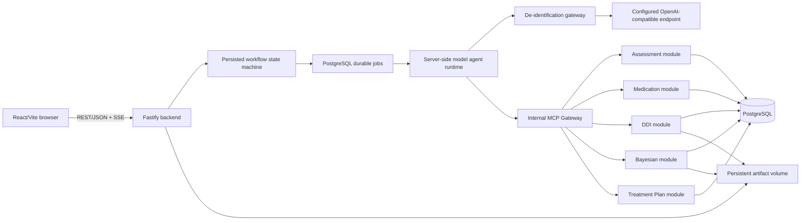
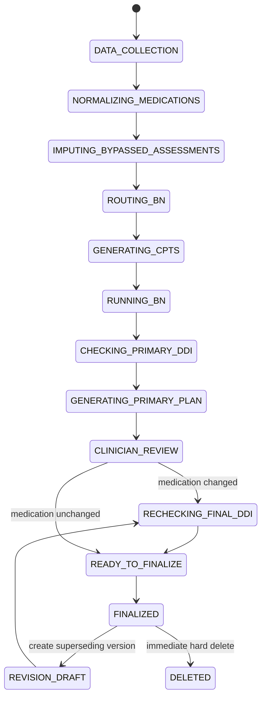

# INSIGHT System Architecture

## Purpose

This document is the implementation-facing architecture for the research prototype. Accepted ADRs remain authoritative when a conflict is found.

## System shape

INSIGHT is a single-tenant, desktop-first web application implemented as a TypeScript modular monolith.

The hosted model is the logical MCP client: it chooses among the tool definitions provided for the current workflow state and emits structured tool calls. The server-side agent runtime is the physical client: it validates and executes those calls against the internal MCP Gateway. The model never receives a public MCP URL.

## Deployment unit

One production container contains:

- the Fastify HTTP server;
- the PostgreSQL-backed job worker;
- the internal MCP Gateway and all domain modules;
- the built React/Vite static assets;
- PostgreSQL, supervised in the same container under the accepted all-in-one constraint.

One external persistent volume stores PostgreSQL data and file-backed artifacts in distinct subdirectories. A deployment represents one research organization/project. Horizontal scaling, multiple application replicas, high availability, Redis, object storage, and multi-tenant routing are out of scope.

## Trust boundaries

### Browser

The browser is untrusted. It can request transitions but cannot establish workflow state, authorization, successful computation, or finalization. It never receives:

- database credentials;
- hosted-model credentials;
- the application master key;
- MCP endpoints;
- de-identification mappings;
- hidden AI-imputed answers or scores.

### Backend

Fastify is the only browser-facing application boundary. It owns authentication, authorization, validation, CSRF protection, rate limiting, state transitions, idempotency, and clinical-content separation.

### Hosted model

The configured OpenAI-compatible endpoint receives only the allowlisted de-identified projection. Direct identifiers, Patient UUIDs, official identifiers, names, and re-identification keys are prohibited. Provider retention, training, and data-processing terms do not gate activation.

### Administrator

Administrators manage users, model endpoint configuration, knowledge artifacts, catalogs, backup/restore, and operational metadata. They cannot access Patient content or clinical audit payloads and have no break-glass path.

### Psychiatrist

Every Psychiatrist can access, edit, finalize, supersede, and immediately hard-delete every Patient in the deployment.

## Backend modules

| Module | Owns | Does not own |
|---|---|---|
| Identity | Users, passwords, sessions, fixed roles | Patient content |
| Patient | Patient identity, demographics, one Research Case | Assessment scoring or plans |
| Assessment | DSM-5-TR, PANSS, C-SSRS answers, bypass and deterministic results | Plan finalization |
| Medical History | Presentation status, trials, comorbidities, current medicines | Canonical terminology |
| Medication | Canonical catalog, normalization mappings, `UNKNOWN` state | DDI conclusions |
| DDI | Source versions, normalized-pair evaluation, warnings | Medication normalization |
| Bayesian | Model versions, routing, CPT validation/snapshots, inference | Treatment authority |
| Treatment Plan | Structured drafts, clinician edits, rechecks, immutable final versions | User authentication |
| Knowledge Administration | Catalog/model/source version lifecycle | Patient-scoped use decisions |
| Jobs | Durable execution, leases, retries, progress, idempotency | Domain success semantics |
| Audit | Operational and clinical event persistence | Tamper evidence |
| Artifact | Relative paths, metadata, hash verification, access checks | Atomic filesystem/database transactions |

Modules own their tables and write them only through module services. Cross-module reads use application contracts. A shared transaction is permitted only through an explicit orchestration service.

## Research Case lifecycle

Each Patient has exactly one Research Case. There is no visit or Encounter entity.

`BYPASSED` is a valid assessment state, not a workflow failure. Required MCP/job failure is not bypassable and blocks finalization. A completed C-SSRS result of any band is informational only.

## Durable execution

LLM calls, assessment imputation, CPT generation, BN inference, DDI evaluation, and plan generation are durable PostgreSQL jobs.

1. A REST command validates the current state and creates a job with an idempotency key.
2. The worker claims it with a lease.
3. Progress events are appended and streamed through authenticated SSE.
4. A restart expires the lease and permits a safe retry.
5. The domain module commits an immutable execution result.
6. The state machine performs the next transition transactionally.

No job may advance the workflow merely because its worker process returned successfully; the domain result must pass its own validation and provenance checks.

## Storage architecture

### PostgreSQL

PostgreSQL stores domain records, workflow state, job state, audit events, endpoint configuration, the encryption master key, and artifact metadata. Sensitive fields are encrypted, but the key is in the same database and therefore does not protect against complete database compromise.

### Artifact volume

XMLBIF files, DDI source documents, exports, and large provenance payloads are files on the persistent volume. PostgreSQL stores relative paths and SHA-256 hashes. Creation is best-effort filesystem-first followed by database metadata; orphan files can remain after failure.

### Backup and restore

Manual Administrator backup exports PostgreSQL only. It does not back up artifacts. Restore replaces the full database in maintenance mode and expects the matching artifact volume to exist independently.

## Network architecture

Runtime egress is required only from the backend to the configured OpenAI-compatible HTTPS endpoint. DDI, BN, assessment, database, and artifact operations are local. The browser uses only same-origin REST and SSE.

## Finalization transaction

Finalization requires:

- authenticated Psychiatrist session;
- current `READY_TO_FINALIZE` state;
- successful, provenance-linked DDI execution for the exact final regimen;
- successful routed BN/CPT execution when required;
- schema-valid structured plan;
- no blocking dependency failure;
- unique finalization idempotency key.

The transaction inserts an immutable Final Treatment Plan version, marks the prior active version `SUPERSEDED` when present, records audit and provenance references, and advances workflow state. DDI findings and completed suicide-risk bands never block this transaction; DDI service failure does.

## Deliberately accepted risks

- default enabled `admin/admin` with no forced change;
- no MFA or SSO;
- encryption key stored with ciphertext;
- hosted-provider retention/training not gated;
- warning-only DDI and suicide-risk results;
- hidden LLM-imputed assessment details and hidden imputation use in final exports;
- automatic medication normalization without confirmation;
- unchecked `UNKNOWN` medication interactions;
- immediate Patient deletion without confirmation;
- ordinary mutable audit tables;
- database-only manual backups;
- best-effort filesystem/database consistency;
- automatic activation of structurally passing BN versions without clinical approval.
