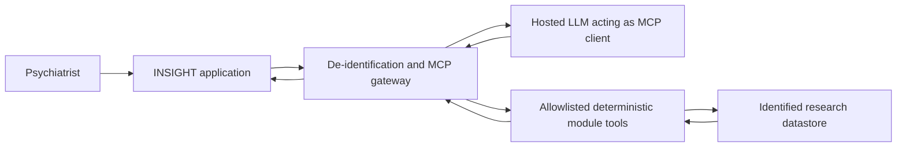

# ADR-003: Patient Identity and Hosted LLM Boundary

- **Status:** Accepted
- **Date:** 2026-08-21
- **Scope:** patient identifiers, LLM authority, hosted-model disclosure

## Context

INSIGHT permits identified records in approved research environments but has no governing jurisdiction. Every patient nevertheless requires an official identifier. The LLM acts as an MCP client and may orchestrate clinical tools, while the selected hosted-model policy prohibits disclosure of identifiers.

## Decision

### Dual patient identity

Every patient record has both:

1. an immutable internal UUID used as the canonical database identity; and
2. a mandatory official identifier represented by `type`, `value`, and `issuingAuthority`.

Each deployment configures its accepted official-identifier types, issuers, format rules, and normalization rules. No specific national identifier is universal. The normalized tuple `(type, issuingAuthority, value)` must be unique within a deployment.

ADR-012 specifies hard duplicate prevention and the minimum demographic fields associated with this identity.

Official identifiers are sensitive data. They must be encrypted at rest, masked by default in the UI, excluded from URLs and routine logs, and visible only to authorized roles. Changing an official identifier creates an attributable history entry; it never changes the internal UUID. ADR-018 places the encryption master key in the same PostgreSQL security boundary, so this field encryption does not survive full database compromise.

### LLM tool-orchestration authority

The backend, not the hosted LLM, owns the workflow. A deterministic persisted state machine validates every transition and exposes only the MCP tools allowed for the Research Case's current state. The LLM cannot skip a backend state, expand its own tool permissions, declare the workflow complete, or create a Final Treatment Plan.

ADR-015 defines the transport boundary: the server-side agent runtime receives model tool requests and executes them against one internal MCP Gateway. The model does not receive a public MCP endpoint, database connection, or browser-held credential.

The hosted LLM is the MCP client and may:

- request bounded patient-context projections;
- invoke deterministic diagnosis, PANSS, DDI, Bayesian-model, and evidence tools;
- sequence those tools within a treatment-plan workflow;
- assemble their structured results into an explainable draft plan;
- ask the psychiatrist for missing facts or confirmation.

The LLM may not:

- directly access the database or arbitrary filesystem paths;
- execute arbitrary SQL or unregistered tools;
- invent patient facts, DDI findings, evidence citations, or completed inference results; ADR-008 explicitly permits generation of per-Research-Case CPT probabilities, and ADR-011 explicitly permits synthetic answers and scores for bypassed assessments when they remain labeled as AI imputations rather than patient facts;
- override deterministic safety blocks or tool failures;
- activate knowledge artifacts or finalize a treatment plan;
- treat free-form chat as the authoritative clinical record.

Required tool failures and missing mandatory data block plan finalization. The psychiatrist must explicitly accept or modify the draft and remains responsible for the final plan.

### Hosted-model de-identification boundary

No direct identifier or re-identification key may enter a hosted-model prompt, model-visible MCP argument, or model-visible MCP result. This includes names, official identifiers, internal UUIDs, contact details, exact addresses, and direct identifiers embedded in free text.

INSIGHT creates an ephemeral session subject reference before invoking the model. A trusted application-side gateway maps that reference to the internal UUID, applies field allowlists and free-text redaction, invokes local module capabilities, and filters results before returning them to the LLM. The mapping never leaves the approved environment.

The application, not the model, reconnects the returned draft to the Patient and its Research Case. Model prompts, responses, tool calls, and tool results follow the application's own retention and audit rules. ADR-022 supersedes the hosted-provider no-training requirement: provider retention, training, and data-processing terms do not gate endpoint activation as long as the transmitted projection passes INSIGHT's de-identification boundary.

## Consequences

- The original mandatory `National Code` field becomes a deployment-configured official-identifier field.
- The hosted model cannot call patient-storage tools that return full records; it receives purpose-specific projections.
- MCP schemas need explicit sensitivity classifications and model-visible field allowlists.
- Free-text inputs require redaction or exclusion before model exposure.
- Reproducibility records must capture model version, prompt/template version, tool versions, knowledge/model versions, tool inputs after de-identification, tool outputs, and clinician edits.
- A deterministic backend state machine enforces authorization, allowed tool calls, required steps, finalization, and immutable persistence even though the LLM selects and sequences permitted tools within the current state.

## Resolution and Verification

- runtime, database, roles, deployment, and encryption-key location are resolved by ADR-004, ADR-006, and ADR-018;
- hosted-model retention and training requirements are resolved by ADR-022;
- the MCP contract defines structured projection allowlists and direct-identifier exclusion;
- residual re-identification testing remains a required verification activity before enabling identified research data, not an open product architecture choice.
